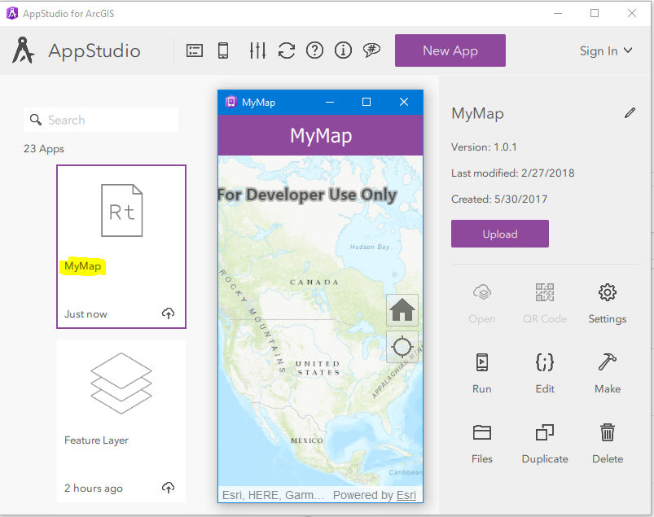
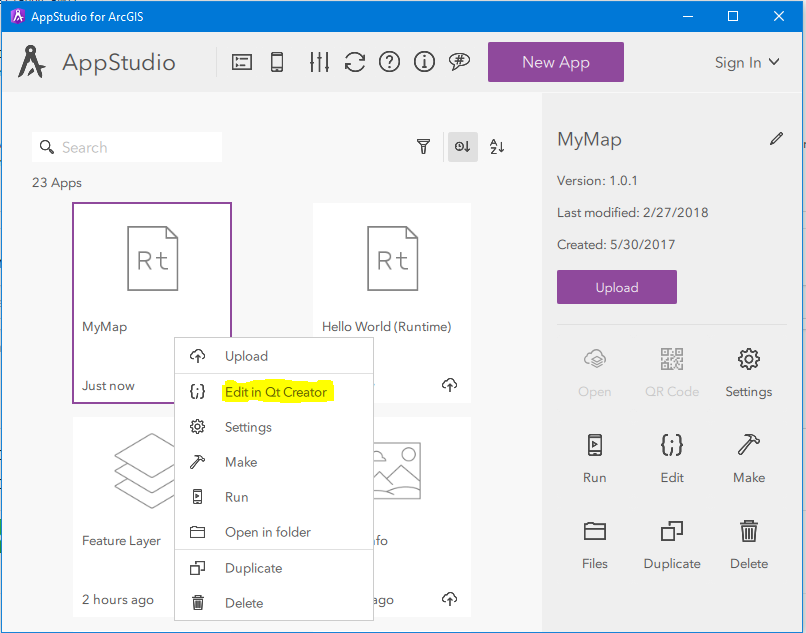

# Tutorial for AppStudio/QT Creator for Map Customization and Adding Feature Layer
This is a how to guide on the basics of creating an application using QT and AppStudio by ESRI. This guide is focused on map making, customization, and adding features to develop a custom app.  
## Getting Started
## Prerequisites
The following items need to be downloaded and/or are required in order to build a custom application on your computer.
1. ESRI Account
2. ESRI AppStudio
3. QT Creator (comes part of the package when AppStudio is downloaded)
4. (optional, but recommended) mobile device

### 1. ESRI Account
This application will not work without an account with ESRI. A standard license is required with ArcGIS in order to access ESRI's app building services.

### 2. ESRI AppStudio
Navigate to this [website](https://doc.arcgis.com/en/appstudio/download/) to find Appstudio on ESRI's website. Based on your computer, download the accurate version of your computer's platform under the highlighted section in figure 1. There is no need to download AppStudio Player unless you want to visualize your applicaiton on your mobile device in which case you can access the app in iOS or Android. AppStudio software will also allow you to visualize the application on a small screen in its completion form. Note - for this tutorial, Windows x64 is the platform of choice. 

*Figure 1*

### 3. QT Creator
There is no need to download QT Creator as it comes with AppStudio. After AppStudio has been downloaded, a quick search in all programs for "AppStudio" will display "AppStudio for Desktop Version" as well as "QT Creator" as seen in figure 2. The necessary components of building an app are complete. Now let's begin with AppStudio to develop our application. 

*Figure 2*

## Installation
#### Below are the intial steps in creating the basic elements of the application starting with AppStudio. 
1. Create a new App (see figure 3)

*Figure 3*

2. Toggle to Starter and click Hello World (Runtime) (see figure 4)
3. Name your app on the top right corner under title (for this example, the name of the app is MyMap)
4. Click on Create

*Figure 4*

5. Double click the new app in AppStudio and you should have a generic map with basic functions display (see figure 5)

*Figure 5*

Now you have a basic app to build upon. Lets move this app to QT creator to do some editing and changing so that we can customize our map to our needs and, later on, add feature layers.
To open the app in QT Creator, right click on the application when in AppStudio and click "Edit in QT Creator" (see figure 6).

*Figure 6*

You are ready to view some coding and work within QT to make changes in the app.

**Remember**: Any changes made in QT Creator can be directly seen in AppStudio by double clicking the app. Remember to "save all" in QT Creator and refresh your app in AppStudio before you open the application so you can view the changes. 

## App Development
